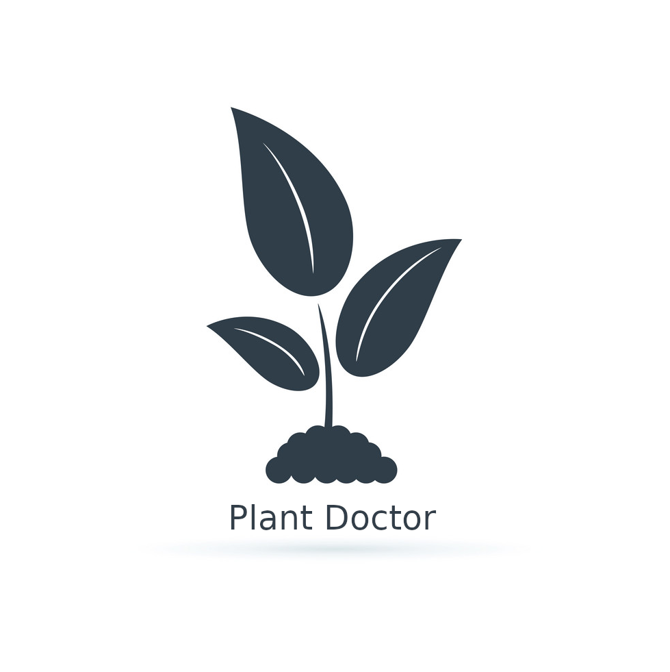
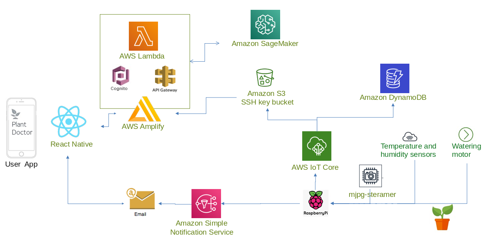

# Plant Doctor application for the final project (IoT based on AWS) on the Cloud Programming course

The main purpose of our project is to give users an ability to have a complete history of their plants’ growth, providing periodical and on demand health reports. It could also provide help for planting different types of plants, given different temperature and humidity recommendations, automatic control of soil moisture and watering when needed. With our product the growth and appearance of plants will be observed, with the initiative to find out whether there are pests and diseases of plants, giving quick advice directly via notification.

### Functionality:

- Image recognition of plant species, recording its suitable growth temperature, proper sunshine and water supply information
- Detecting temperature, soil moisture, UV intensity
- According to the recorded information, when detected values start to be not in the suitable range, sending the notification to the user
- Automatic watering when soil humidity is too low
- Daily checking of plant leaves via image recognition, to detect whether there are pests and diseases. If there is an anomaly, identifying the condition (lack of water, mold, rot, need to fertilize, insect bites, etc) and sending a message to the user
- Making daily photos to record the growth of plants and store it in the app (to let the user enjoy the growth and flowering in the retrospect)
- Getting the weather forecast information, such as the next day's weather is not suitable for plants (sudden cold, ultraviolet too strong), and inform the user and remind him to move the pot with the plant indoors and vice-versa _(not realized yet)_
- Creating “families” of people living together to have common plants to look after

### Main technologies used:

- React Native (Expo)
- AWS Lambda
- Amazon Cognito
- AWS IoT Core (for communication with RaspberryPi)
- Amazon S3
- Amazon Amplify
- Amazon SageMaker
- Amazon DynamoDB
- Amazon Simple Notification Service

### Architecture of the system:

Backend computation is done on AWS Lambda, serverless code stored in [/lambda](/lambda) is just for the reference.

Our project proposal with more information & description can be found [here](https://docs.google.com/document/d/1pu7S9EIk3FHnIWsuC72eXmd70DJ1Apx0CWdgSiAhXG8/edit?usp=sharing).
